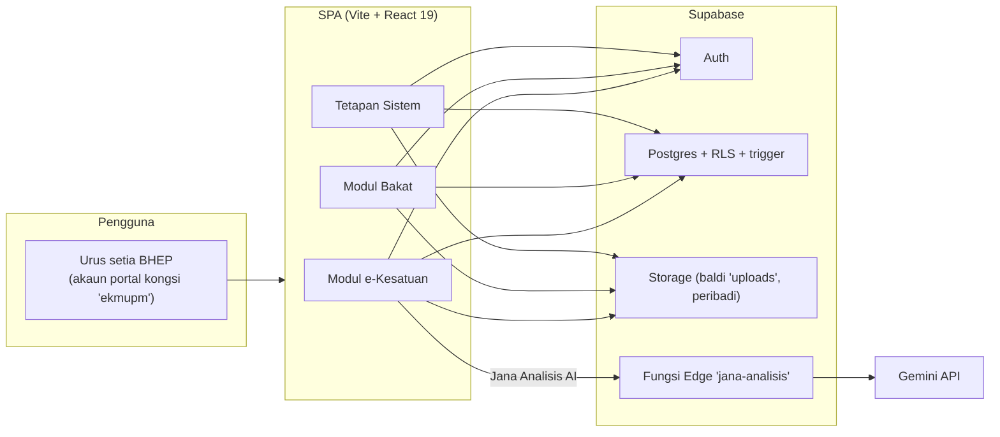
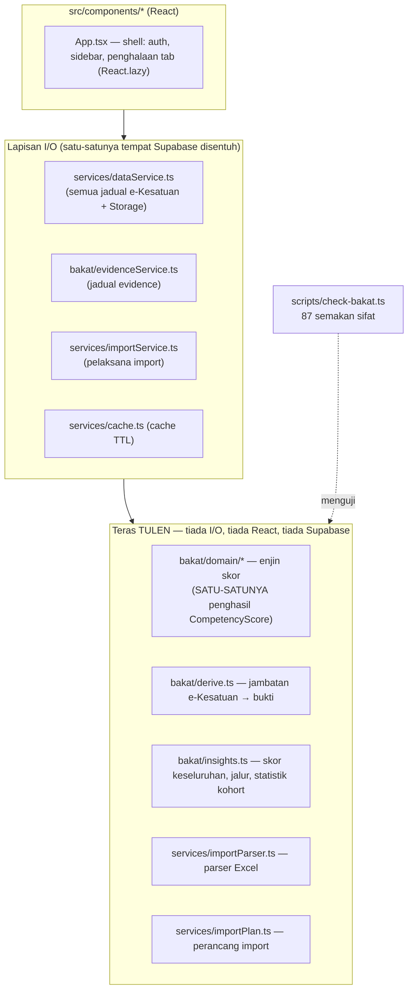
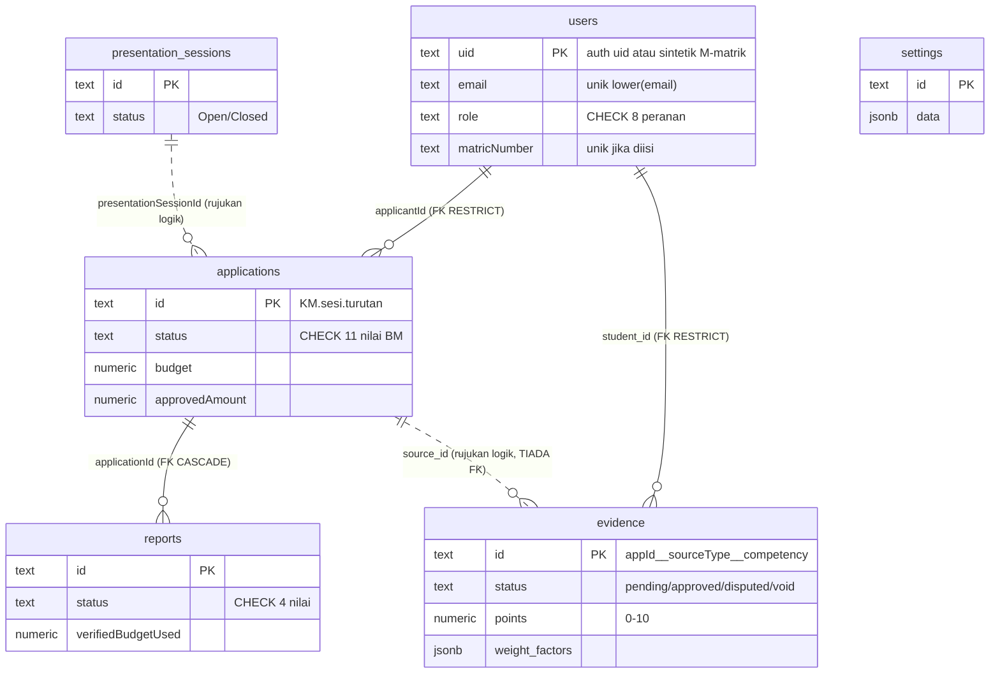
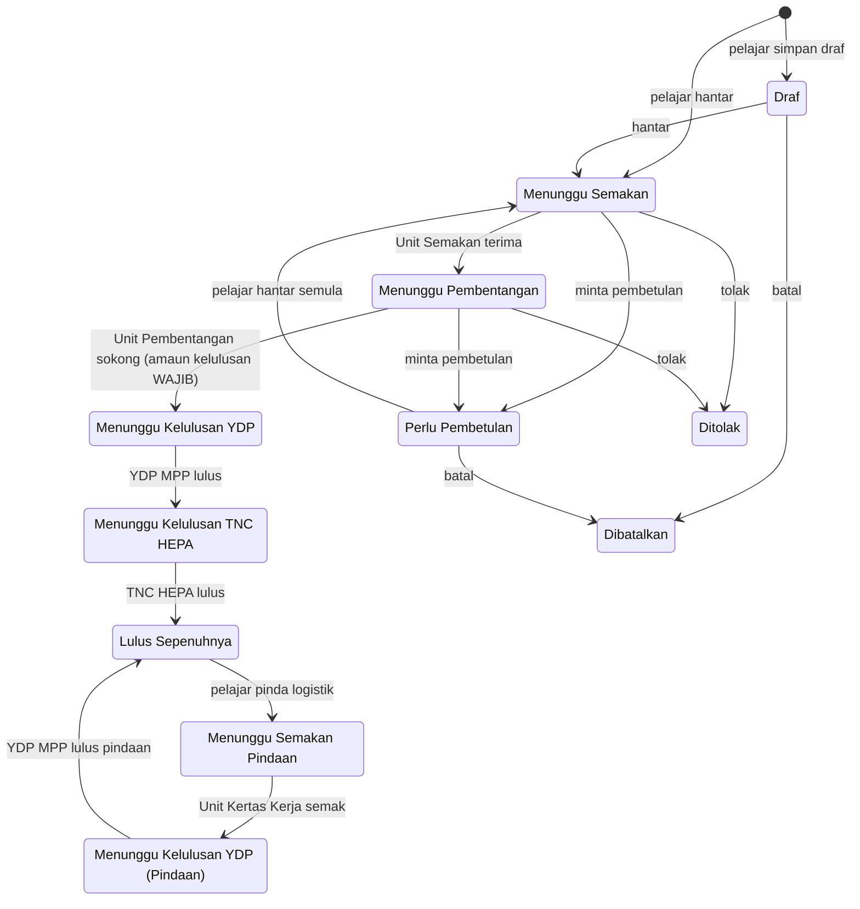
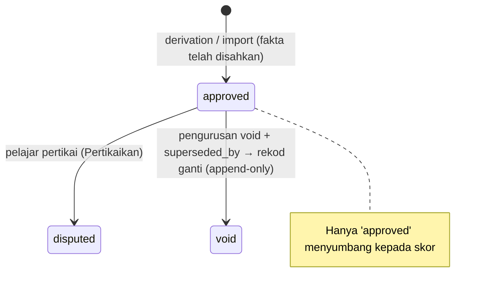
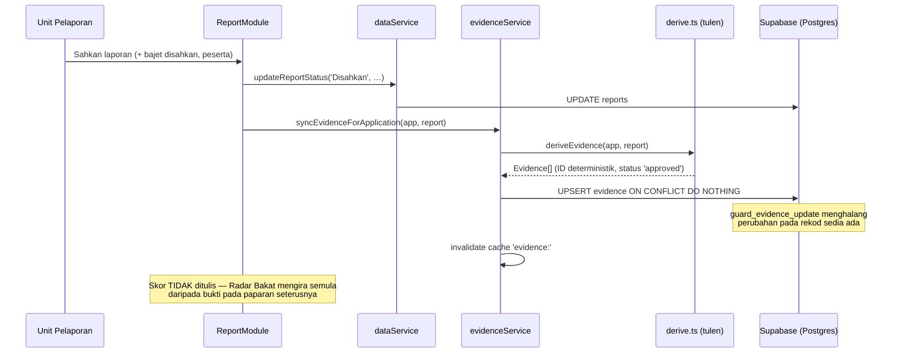

# Dokumen Reka Bentuk Perisian (SDD) — Portal Aktiviti Pelajar UPM

| Medan           | Nilai                                                                      |
| --------------- | -------------------------------------------------------------------------- |
| Versi dokumen   | 1.0                                                                        |
| Tarikh          | 2026-07-23                                                                 |
| Status          | Selaras dengan kod semasa repositori (`main`, selepas remediasi 8 fasa)    |
| Repositori      | `nikridhwan95-ai/e-Kesatuan-Mahasiswa`                                     |
| Dokumen berkait | `docs/SCHEMA.md` (rujukan skema), `docs/HANDOFF.md` (keputusan dan status) |

## 1. Pengenalan

### 1.1 Tujuan

Dokumen ini menerangkan reka bentuk perisian **Portal Aktiviti Pelajar UPM** —
seni bina, reka bentuk data, aliran proses, enjin skor bakat, model
keselamatan dan reka bentuk antara muka — supaya pembangun, penyelenggara dan
pemegang taruh BHEP UPM memahami _bagaimana_ dan _mengapa_ sistem dibina
sebegini. Setiap fakta dalam dokumen ini dipetik daripada kod sebenar dalam
repositori.

### 1.2 Skop

Portal web bersepadu untuk Bahagian Hal Ehwal Pelajar (BHEP) UPM yang
menggabungkan dua modul saling berkait:

1. **e-Kesatuan Mahasiswa** — pengurusan permohonan aktiviti pelajar: borang
   kertas kerja → aliran kelulusan berperingkat (Unit Semakan → Pembentangan →
   YDP MPP → TNC HEPA) → laporan pascaprogram yang disahkan Unit Pelaporan.
2. **Modul Bakat / Radar Bakat** — kecerdasan bakat pelajar berasaskan prinsip
   _evidence-first_ (spesifikasi asal: SDD TalentOS v2.0): skor kompetensi
   sentiasa diterbitkan semula daripada bukti, tidak pernah disimpan.

Di luar skop: aplikasi mudah alih natif, notifikasi e-mel, akaun log masuk
individu pelajar (lihat §13 untuk hala tuju).

### 1.3 Rujukan

- SDD TalentOS v2.0 — spesifikasi asal Modul Bakat; rujukan §4.4 (IRON RULE),
  §7.3 (model bukti), §8.4 (taksonomi), §8.5 (enjin skor), Appendix C
  (pendarab). Nombor seksyen "SDD §…" dalam komen kod merujuk dokumen itu.
- `supabase/schema.sql` — sumber kebenaran skema pangkalan data.
- `docs/HANDOFF.md` — keputusan yang telah dipersetujui pemilik; WAJIB dibaca
  sebelum mengubah reka bentuk.

### 1.4 Istilah

| Istilah     | Maksud                                                                        |
| ----------- | ----------------------------------------------------------------------------- |
| Bukti       | Rekod `evidence` — fakta pencapaian pelajar yang tidak boleh diubah           |
| Kompetensi  | Satu daripada 16 dimensi bakat (kod 3 huruf, cth `LEA`)                       |
| IRON RULE   | Prinsip §4.4: skor TIDAK PERNAH disimpan; hanya bukti disimpan                |
| Faktor Masa | Susutan eksponen skor mengikut usia bukti (separuh hayat 24 bulan)            |
| KM          | Kesatuan Mahasiswa (awalan ID permohonan)                                     |
| Pindaan     | Perubahan logistik program yang telah lulus, melalui kitaran kelulusan pendek |
| RLS         | Row Level Security (polisi capaian baris Postgres/Supabase)                   |

## 2. Gambaran Keseluruhan Sistem

### 2.1 Konteks



Aplikasi ialah SPA statik (boleh dihoskan di Netlify/Vercel); semua keadaan
kekal berada di Supabase. Tiada pelayan aplikasi sendiri — satu-satunya kod
sisi pelayan ialah Fungsi Edge `jana-analisis` (proksi Gemini).

### 2.2 Pengguna dan peranan

Sistem menggunakan **SATU akaun portal kongsi**: nama pengguna `ekmupm`
dipetakan kepada e-mel sintetik `ekmupm@portal-bhep.upm.edu.my`
(`src/supabase.ts`). Pelajar tidak log masuk; rekod pelajar menggunakan uid
sintetik `M-<matrik>`. Lapan peranan ditakrifkan dalam `src/types.ts` dan
dikuatkuasakan oleh kekangan CHECK `users_role_chk`:

| Peranan             | Tanggungjawab dalam aliran kerja                                        |
| ------------------- | ----------------------------------------------------------------------- |
| `student`           | Memohon, memapar status, menghantar laporan, mempertikaikan bukti       |
| `unit_semakan`      | Semakan awal kertas kerja (terima / pembetulan / tolak)                 |
| `unit_pembentangan` | Sesi pembentangan; sokong dengan amaun kelulusan                        |
| `unit_kertas_kerja` | Semakan pindaan kertas kerja; tetapan surat kelulusan                   |
| `unit_pelaporan`    | Pengesahan laporan pascaprogram (pencetus penjanaan bukti)              |
| `ydp`               | Kelulusan eksekutif YDP MPP (termasuk kelulusan akhir pindaan)          |
| `tnc_hepa`          | Kelulusan akhir TNC HEPA                                                |
| `admin`             | Semua modul + analitik, Radar Bakat, direktori pelajar, import, tetapan |

Pemilih peranan **"Uji"** pada header (admin sahaja) hanya menukar PAPARAN
klien — kawalan sebenar ialah RLS dan trigger pangkalan data (§9).

### 2.3 Modul

Navigasi disusun dalam tiga kumpulan (`src/App.tsx`): **e-Kesatuan
Mahasiswa** (papan pemuka, permohonan, kelulusan, pembentangan, laporan,
arkib, analitik), **Portal Bakat** (profil bakat pelajar / Radar Bakat dan
direktori pelajar), dan **Tetapan Sistem** (tetapan surat, import Excel,
tetapan sistem). Item yang dipaparkan berbeza mengikut peranan (§10.2).

## 3. Seni Bina Sistem

### 3.1 Tindanan teknologi

| Lapisan | Teknologi                                                                        |
| ------- | -------------------------------------------------------------------------------- |
| Binaan  | Vite 6 (+ `@tailwindcss/vite`), TypeScript ~5.8 mod `strict`, ESLint 10 flat     |
| UI      | React 19, Tailwind CSS v4, lucide-react (ikon), recharts 3 (carta, dimuat malas) |
| Data    | `@supabase/supabase-js` 2 (Auth, Postgres, Storage, Functions)                   |
| Import  | xlsx 0.18 (dimuat secara dinamik dalam modul import sahaja)                      |
| Semakan | `tsx` menjalankan `scripts/check-bakat.ts` (87 semakan sifat)                    |

### 3.2 Prinsip pelapisan — teras tulen, pinggir I/O

Reka bentuk memisahkan **fungsi tulen deterministik** (boleh diuji tanpa
kerangka berat) daripada **lapisan I/O Supabase**:



Peraturan pelapisan (dikuatkuasakan melalui konvensyen dan semakan kod):

- `src/bakat/domain/scoring.ts` ialah SATU-SATUNYA tempat `CompetencyScore`
  boleh dihasilkan (IRON RULE, §6.1).
- Modul tulen tidak mengimport `supabase`; lapisan I/O tidak mengandungi
  logik perniagaan selain unjuran lajur, senarai putih medan dan pembatalan
  cache.
- `services/cache.ts` ialah cache TTL dalam memori (users/bukti 30 s, tetapan
  60 s); setiap mutasi WAJIB memanggil `invalidate()`. Ia sengaja bukan
  TanStack Query — satu akaun kongsi dan segelintir skrin tidak mewajarkan
  kebergantungan tambahan (nilai semula jika akaun pelajar individu
  diperkenalkan).

### 3.3 Susunan direktori

```
src/
  App.tsx                    # shell sahaja: auth, sidebar 3 kumpulan, tab React.lazy
  main.tsx                   # StrictMode → ErrorBoundary → ToastProvider → ConfirmProvider
  supabase.ts                # klien + usernameToEmail + AppUser
  types.ts                   # SATU-SATUNYA fail jenis e-Kesatuan (status BM)
  constants.ts               # SEMESTER_ALLOCATION, palet kategori CVD-safe
  utils/dateUtils.ts         # parseTarikh/formatTarikh, sesi akademik, semester
  services/                  # dataService, importParser/Plan/Service, cache
  bakat/                     # domain/ (enjin tulen), derive, insights, evidenceService
  components/
    shared/                  # StatusBadge, FileLink, ToastProvider, ConfirmDialog, ErrorBoundary
    application/             # Module (orkestrator) + List / Detail / Form / Timeline
    review/ presentation/ report/ approval/ archive/ dashboard/
    bakat/ admin/ import/ settings/ profile/
supabase/
  schema.sql                 # SUMBER KEBENARAN: jadual + RLS + trigger + FK + Storage + benih
  functions/jana-analisis/   # Fungsi Edge (Deno) — proksi Gemini sisi pelayan
scripts/check-bakat.ts       # semakan sifat (dijalankan CI)
```

### 3.4 Prestasi

- **Pemisahan kod**: setiap tab dimuat melalui `React.lazy`; `manualChunks`
  mengasingkan recharts (≈416 KB) dan supabase-js; xlsx dimuat melalui
  `import()` dinamik dalam modul import sahaja. Bundle awal ≈220 KB
  (sebelum pemisahan: ≈1.86 MB).
- **Cache TTL** (§3.2) menghapuskan panggilan `getUsers()` berulang (7+
  modul membaca senarai yang sama pada setiap tukar tab).
- **Unjuran lajur eksplisit** — tiada `select('*')` pada laluan senarai;
  senarai pengguna tidak membawa medan sensitif (§9.2).

## 4. Reka Bentuk Data

### 4.1 Gambaran hubungan



### 4.2 Konvensyen penamaan dan jadual

- Lajur e-Kesatuan menggunakan **camelCase dipetik** supaya SAMA dengan jenis
  TypeScript (`src/types.ts`) — tiada lapisan pemetaan. Jadual `evidence`
  menggunakan **snake_case** selaras `src/bakat/domain/types.ts`.
- Nilai status dan peranan dikawal kekangan CHECK yang WAJIB kekal seiras
  dengan union literal dalam `src/types.ts` (11 status permohonan, 4 status
  laporan, 4 status bukti, 2 status sesi, 8 peranan).
- `settings` ialah stor fleksibel `id → data jsonb`: senarai `categories`
  (8 Teras lalai), `faculties` (15 lalai), `colleges` (17 lalai) dan objek
  `approvalLetter` (tetapan surat).
- Lajur legasi `applications."aiSummary"` kekal dalam DB tetapi TIDAK dibaca
  aplikasi (dikecualikan daripada unjuran lajur).

### 4.3 Konvensyen ID

| Entiti         | Format                                | Penjana                                                                                                 |
| -------------- | ------------------------------------- | ------------------------------------------------------------------------------------------------------- |
| Permohonan     | `KM.<yy-yy>.<turutan 3 digit>`        | Sesi bermula September; turutan baca-maks; perlanggaran kunci (kod 23505) dicuba semula sehingga 3 kali |
| Pelajar import | uid sintetik `M-<matrik>`             | `importedStudentUid` (parser import)                                                                    |
| Bukti          | `{appId}__{sourceType}__{competency}` | Deterministik — teras keidempotenan penjanaan (§6.5)                                                    |
| Laporan / sesi | UUID (`gen_random_uuid()`)            | Lalai pangkalan data                                                                                    |

### 4.4 Integriti data

- **Kunci asing** (ditambah `NOT VALID`, kemudian `VALIDATE` berasingan
  supaya baris lama yang yatim tidak menggagalkan skrip):
  `reports.applicationId → applications` (CASCADE),
  `applications.applicantId → users` (RESTRICT),
  `evidence.student_id → users` (RESTRICT). `evidence.source_id` SENGAJA
  tiada FK — rujukan polimorfik untuk bukti manual masa hadapan.
- **Indeks unik**: `lower(email)`; `matricNumber` (separa, jika diisi).
- **Trigger kawalan** (BEFORE UPDATE, pertahanan dalam kedalaman di sebalik
  RLS — butiran §9.3): `guard_application_update`, `guard_report_update`,
  `guard_evidence_update`.
- **Keidempotenan skrip skema**: `supabase/schema.sql` dijalankan semula
  secara manual oleh pemilik (dua kali; jalanan kedua mesti tanpa ralat) —
  maka setiap perubahan skema WAJIB berbentuk boleh-ulang (`if not exists`,
  `add column if not exists`, `or replace`, blok `DO $$` berpengawal).
- **Tarikh disimpan sebagai `text`** (bukan `timestamptz`) — penangguhan
  sengaja (§13); dikurangkan oleh penghuraian tahan-rosak
  (`parseTarikh`/`normalizeDate`).

### 4.5 Storan fail

Baldi Storage `uploads` adalah **PERIBADI** (fail mengandungi data peribadi
pelajar — kertas kerja, resit kewangan). Reka bentuk capaian:

- `uploadFile` menyimpan **laluan** (bukan URL) dalam DB; laluan muat naik
  terhad kepada prefiks `applications/`, `reports/`, `settings/`.
- `getFileUrl` menjana **URL bertandatangan 1 jam**; ia turut memahami URL
  awam legasi dalam rekod lama (menghurai laluan daripada URL penuh).
- Objek tidak boleh ditulis ganti (tiada polisi UPDATE; semua laluan muat
  naik unik dengan cap masa); padam oleh admin sahaja.

## 5. Reka Bentuk Proses — e-Kesatuan Mahasiswa

### 5.1 Kitaran hayat permohonan



Nota reka bentuk:

- **Turutan kelulusan** dikodkan dalam `ReviewModule` sebagai tangga status;
  pada setiap peringkat pengurusan boleh juga memilih `Ditolak` atau `Perlu
Pembetulan` (dengan ulasan). `updateApplicationStatus` menyimpan status,
  ulasan penyemak dan (pada peringkat pembentangan) `approvedAmount`.
- **Sesi pembentangan**: admin mencipta `presentation_sessions`
  (nama, tarikh, masa, bilangan bilik, pautan; status `Open`/`Closed`) dan
  menetapkan permohonan kepada sesi/bilik melalui
  `updateApplicationPresentation` (turut menetapkan status
  `Menunggu Pembentangan`). Unit Pembentangan membuat keputusan pada sesi:
  sokong (wajib amaun kelulusan, tidak negatif) / pembetulan / tolak.
- **Pindaan**: untuk program yang telah `Lulus Sepenuhnya`, pemohon boleh
  meminda LOGISTIK sahaja (tajuk, tarikh, tempat, penceramah, anjuran
  bersama) — medan teras lain dikunci dalam borang. Pindaan melalui kitaran
  pendek: Unit Kertas Kerja → YDP MPP → `Lulus Sepenuhnya` (tanpa TNC HEPA).
- **Surat kelulusan rasmi** dijana daripada tetapan `approvalLetter`
  (kepala surat, penandatangan) untuk permohonan yang lulus
  (`ApprovalLetterModule`; boleh dicetak).
- **ID permohonan** dijana pada penciptaan (§4.3).

### 5.2 Laporan pascaprogram

Satu laporan per program `Lulus Sepenuhnya` (`reports.applicationId`, FK
CASCADE). Kitaran status: `Tertunggak` → `Dihantar` (pelajar melampirkan
laporan dan resit, mengisi perbelanjaan dan bilangan peserta) →
**`Disahkan`** atau `Perlu Pembetulan` (Unit Pelaporan; boleh mengiringi
`verifiedBudgetUsed` dan `participantCount` yang disahkan — senarai putih
medan dalam `updateReportStatus`). `Perlu Pembetulan` → `Dihantar` semula.
Pengesahan laporan ialah **pencetus penjanaan bukti bakat** (§7).

## 6. Reka Bentuk Modul Bakat

### 6.1 IRON RULE (SDD TalentOS v2.0 §4.4) — invarian utama sistem

> Skor kompetensi TIDAK PERNAH disimpan. Hanya jadual `evidence` disimpan;
> setiap skor dikira semula pada setiap paparan oleh enjin tulen
> deterministik daripada bukti berstatus `approved` sahaja.

Implikasi reka bentuk:

1. `src/bakat/domain/scoring.ts` ialah satu-satunya penghasil
   `CompetencyScore`; tiada jadual skor dalam skema.
2. Bukti **tidak boleh diubah**: pertikaian hanya menukar `status` kepada
   `disputed` (baris kekal; enjin mengecualikannya). Trigger DB
   `guard_evidence_update` menghalang sebarang perubahan lajur lain (§9.3).
3. Penjanaan **idempotent**: ID deterministik `{appId}__{sourceType}__{competency}`
   di-upsert dengan `ON CONFLICT DO NOTHING` — rekod sedia ada (termasuk
   status dispute/void yang telah ditetapkan) tidak sekali-kali ditulis semula.
4. Semua statistik papan pemuka diterbitkan daripada peraturan atas data
   sebenar; satu-satunya kandungan AI ialah teks "Jana Analisis AI" (§9.5).

### 6.2 Taksonomi kompetensi (16 entri, §8.4)

| Kluster       | Kompetensi                                                                                                          |
| ------------- | ------------------------------------------------------------------------------------------------------------------- |
| Kognitif      | INN Inovasi · ART Seni Kreatif · RES Penyelidikan · CRT Pemikiran Kritis                                            |
| Interpersonal | LEA Kepimpinan · COM Komunikasi · NEG Perundingan · NET Jaringan                                                    |
| Pelaksanaan   | TEC Teknikal · ENT Keusahawanan · SPO Sukan · DIG Kemahiran Digital · PRJ Pengurusan Projek · FIN Literasi Kewangan |
| Nilai         | VOL Kesukarelawanan · GLO Pendedahan Global                                                                         |

Derivation e-Kesatuan (§6.5) mampu mengisi 12 kompetensi; **INN, TEC, GLO
dan NEG tiada laluan derivation** dan kekal 0 sehingga bukti
`manual_endorsement` diperkenalkan. Radar hanya memaparkan kompetensi yang
berskor (keputusan pemilik — HANDOFF §9).

### 6.3 Enjin skor (§8.5, `scoring-v1`)

```
skor(pelajar, kompetensi) = min(100, Σ bukti 'approved':
    mata × faktor_peranan × faktor_peringkat × faktor_kehadiran × Faktor_Masa)
tertakluk pada had per-jenis-sumber (skala-turun berkadar)
```

Langkah pengiraan (`scoreBreakdown`):

1. **Sumbangan mentah per bukti** — `mata` diklamp 0–10 (nilai NaN → 0);
   pendarab peranan dan peringkat dicari daripada `weight_factors`
   (tiada nilai → 1).
2. **Had per jenis sumber**: jumlah kumpulan setiap `source_type` yang
   melebihi hadnya diskala turun secara berkadar. Had lalai (mata terkumpul
   maksimum per kompetensi): `participation` 25 · `committee_role` 60 ·
   `competition_result` 50 · `certificate` 20 · `achievement` 40 ·
   `manual_endorsement` 15. Tujuan: menghalang "gaming" melalui lambakan
   bukti sejenis.
3. **Had keseluruhan 100**: jika jumlah masih melebihi 100, semua sumbangan
   diskala turun secara berkadar.
4. **Pembundaran 1 t.p.** — sumbangan berkesan per bukti menjumlah TEPAT
   kepada skor paksi (kriteria SCR-02; asas paparan drill-down).

Faktor (nilai tepat daripada Appendix C dan §8.5):

| Faktor peranan                                   | Faktor peringkat                 |
| ------------------------------------------------ | -------------------------------- |
| participant 1.0 · volunteer 1.15 · committee 1.3 | faculty 1.0 · university 1.2     |
| secretary 1.45 · treasurer 1.45 · vice_chair 1.6 | national 1.5 · international 1.8 |
| chairperson 1.8 (termasuk Pengarah Program)      |                                  |

- **Faktor kehadiran**: linear 0.5–1.0 (0% → 0.5, 100% → 1.0); tiada data
  atau bukan nombor → 1.0.
- **Faktor Masa** (susutan recency): `0.5^(bulan_lalu / 24)` — separuh hayat
  24 bulan; acara masa hadapan dihadkan pada 1.0 (tiada galakan).
- **Konvensyen keteguhan**: sebarang input tidak sah (tarikh rosak, NaN)
  menghasilkan faktor NEUTRAL 1 — satu baris bukti yang rosak tidak boleh
  meracuni keseluruhan skor dengan NaN.
- Setiap skor dicap `engine_version: 'scoring-v1'` (kebolehulangan).

### 6.4 Skor keseluruhan, jalur dan statistik

- **Skor Bakat Keseluruhan** = purata skor **BUKAN SIFAR** dalam kalangan 3
  kompetensi tertinggi. Kompetensi kosong tidak mencairkan purata: pelajar
  dengan satu kekuatan 90 mendapat 90, bukan 30 — profil sempit tetapi
  cemerlang tidak dihukum kerana keluasan.
- **Jalur prestasi**: Cemerlang ≥90 · Baik 70–89 · Berkembang 50–69 · Perlu
  Peningkatan <50. **Potensi Tinggi** ≥70.
- **Statistik kohort** (`computeCohortStats`, tulen; `asOf` boleh disuntik
  supaya deterministik): senarai pelajar tertib skor, taburan jalur,
  statistik per kompetensi, bilangan program penyumbang, pelajar tanpa bukti.
- **Sorotan** (`computeSorotan`) dan **ringkasan bakat individu**
  (`talentSummary`) adalah berasaskan peraturan — BUKAN AI.

### 6.5 Jambatan derivation e-Kesatuan → bukti (`src/bakat/derive.ts`)

Fungsi tulen dan TOTAL (tidak melempar; tarikh rosak jatuh kepada penanda
epok yang direputkan Faktor Masa kepada ~0). Program **layak** apabila
`status = 'Lulus Sepenuhnya'` DAN laporan `Disahkan` — sebab itulah bukti
terbitan lahir terus berstatus `approved` (`approved_by:
'e-kesatuan:unit_pelaporan'`): fakta asalnya telah melalui rantaian kelulusan
penuh.

Pemetaan (lampiran penuh di §Lampiran A):

| Fakta e-Kesatuan                       | Bukti terbitan                                                                                           |
| -------------------------------------- | -------------------------------------------------------------------------------------------------------- |
| Jawatan Pengarah / Setiausaha          | `committee_role`: LEA (8 mata), PRJ (7 mata); FIN (4 mata) jika bajet > 0                                |
| Peringkat penganjuran                  | Faktor peringkat pada semua bukti (Antarabangsa ×1.8 … Kolej/Fakulti ×1.0; Negeri dipetakan ke national) |
| Kategori program (8 Teras)             | `achievement` 6 mata untuk kompetensi teras kategori                                                     |
| Kemahiran insaniah yang dideklarasikan | `achievement` 3 mata per kemahiran yang dipetakan                                                        |

Butiran teknikal: `event_date` = `endDate` (jatuh balik `startDate`, kemudian
`updatedAt`/`createdAt`); bajet FIN = `verifiedBudgetUsed` laporan (jatuh
balik `approvedAmount`, kemudian `budget`); pendua per
`sourceType:competency` dalam satu program dielakkan (rekod pertama menang).

### 6.6 Kitaran hayat bukti



Status `pending` wujud dalam skema untuk bukti manual masa hadapan. Pelajar
hanya boleh menukar bukti SENDIRI daripada `approved` kepada `disputed`
(polisi RLS); penggantian void memerlukan peranan pengurusan.

## 7. Integrasi Antara Modul

Bukti dijana pada tiga titik — semuanya menumpu ke laluan idempotent yang
sama (`syncEvidenceForApplication` → `deriveEvidence` → upsert
`ignoreDuplicates`):

1. **Pengesahan laporan** oleh Unit Pelaporan (ReportModule) — laluan utama.
2. **Butang "Jana Bukti"** (backfill, dalam Radar Bakat admin) —
   `syncAllEvidence()` mengimbas semua program layak dan menjana bukti yang
   belum wujud; selamat diulang bila-bila masa.
3. **Import Excel** program lepas (§8) — setiap baris yang sah menghasilkan
   permohonan + laporan + bukti melalui enjin derivation sebenar.



## 8. Import Excel (Tetapan Sistem → Import Data)

Dua mod, kedua-duanya admin sahaja:

1. **Program Lepas** — satu baris = satu program yang TELAH selesai. Templat
   16 lajur (nama, matrik, e-mel, fakulti, kolej, jawatan, tajuk, kategori,
   peringkat, tarikh mula/tamat, bajet diluluskan/disahkan, peserta,
   kemahiran insaniah, objektif). Setiap baris sah mencipta (jika belum
   wujud): rekod pelajar (uid sintetik `M-<matrik>`) → permohonan
   `Lulus Sepenuhnya` → laporan `Disahkan` → bukti bakat.
2. **Butiran Pelajar** — padanan melalui no. matrik; pelajar sedia ada
   DIKEMAS KINI (hanya medan yang diisi dalam Excel), pelajar baharu dicipta
   (e-mel sintetik `<matrik>@import.portal-bhep.upm.edu.my` jika tiada).

Reka bentuk ketahanan:

- **Keputusan dibuat oleh perancang TULEN** `importPlan.ts` (diuji
  check:bakat): kunci penduaan `matrik + tajuk + tarikh mula` (baris kembar
  dalam fail yang sama turut dilangkau), padanan pelajar melalui matrik
  (termasuk penerbitan matrik daripada uid sintetik `M-…` untuk permohonan
  lama), peruntukan ID `KM.<sesi>.<seq>` menyambung turutan sedia ada per
  awalan sesi (sesi mengikut tarikh mula program).
- **Selamat-gagal**: rekod import ditanda `IMPORT_MARKER` pada
  `reviewerComment`; jika penciptaan laporan gagal, permohonan dipadam
  semula (tiada yatim kekal). Baki yatim lama boleh dibaiki dengan butang
  **Pulihkan Import** (`reconcileImportOrphans`).

## 9. Reka Bentuk Keselamatan

### 9.1 Model pengesahan

- Log masuk nama pengguna + kata laluan; `usernameToEmail` memetakan
  `ekmupm` → `ekmupm@portal-bhep.upm.edu.my` (akaun Supabase Auth sebenar).
- **Pendaftaran awam DIMATIKAN** di Supabase Dashboard; TIADA `signUp`
  automatik dalam kod klien (vektor pengambilalihan akaun ditutup).
- Peranan datang HANYA daripada `users.role` — dibenih oleh
  `supabase/schema.sql` untuk akaun portal. TIADA e-mel dikod keras dalam
  `is_admin()` mahupun klien (e-mel yang dikod keras boleh didaftarkan
  penyerang melalui API awam).
- Kunci dalam bundle klien ialah _publishable key_ (selamat didedahkan;
  kawalan sebenar ialah RLS). `VITE_SUPABASE_URL` /
  `VITE_SUPABASE_PUBLISHABLE_KEY` dalam `.env.local` boleh mengatasinya.

### 9.2 Ringkasan polisi RLS (semua jadual `to authenticated`; kunci anon tidak boleh menyentuh apa-apa)

| Jadual                  | SELECT                          | INSERT                                                        | UPDATE                                                                | DELETE                       |
| ----------------------- | ------------------------------- | ------------------------------------------------------------- | --------------------------------------------------------------------- | ---------------------------- |
| `users`                 | diri sendiri atau pengurusan    | profil sendiri (peranan student) atau admin (rekod student)   | diri sendiri TANPA tukar peranan; admin bebas                         | —                            |
| `applications`          | pemohon sendiri atau pengurusan | pelajar: milik sendiri, status awal sahaja; pengurusan: bebas | pelajar: milik sendiri semasa Draf/Perlu Pembetulan; pengurusan       | admin                        |
| `reports`               | pemohon sendiri atau pengurusan | pelajar: milik sendiri, Tertunggak/Dihantar; pengurusan       | pelajar: milik sendiri semasa Tertunggak/Perlu Pembetulan; pengurusan | admin                        |
| `presentation_sessions` | semua                           | pengurusan                                                    | pengurusan                                                            | pengurusan                   |
| `settings`              | semua                           | admin atau unit_kertas_kerja                                  | admin atau unit_kertas_kerja                                          | admin atau unit_kertas_kerja |
| `evidence`              | pelajar sendiri atau pengurusan | pengurusan sahaja                                             | pelajar: bukti sendiri `approved → disputed` SAHAJA; pengurusan       | admin                        |

Fungsi bantu (`my_role`, `is_management`, `is_admin`) adalah
`SECURITY DEFINER` supaya semakan peranan tidak rekursif melalui RLS `users`.

### 9.3 Trigger kawalan (pertahanan dalam kedalaman)

Semua operasi hari ini berjalan atas akaun portal berperanan pengurusan;
trigger wujud sebagai lapisan kedua di sebalik RLS dan bersedia untuk akaun
pelajar individu pada masa hadapan:

- `guard_application_update` — bukan-pengurusan tidak boleh mengubah medan
  terkawal (`approvedAmount`, `reviewerComment`, medan pembentangan,
  `applicantId`, `createdAt`) dan hanya boleh beralih daripada
  Draf/Perlu Pembetulan kepada
  {Draf, Perlu Pembetulan, Menunggu Semakan, Menunggu Semakan Pindaan, Dibatalkan}.
- `guard_report_update` — medan pengesahan (`verifiedBudgetUsed`,
  `reviewedAt`, `reviewerComment`) terkawal; peralihan pelajar terhad
  Tertunggak/Perlu Pembetulan → {Tertunggak, Perlu Pembetulan, Dihantar}.
- `guard_evidence_update` — IRON RULE di peringkat DB: semua lajur beku
  kecuali `status` (dan `superseded_by`, oleh pengurusan sahaja).

### 9.4 Fungsi Edge `jana-analisis` (satu-satunya laluan AI)

- Kunci `GEMINI_API_KEY` hanya wujud sebagai rahsia fungsi — TIDAK PERNAH
  dalam bundle klien (nota keselamatan turut dikodkan dalam
  `vite.config.ts`: jangan menyuntik kunci melalui `define`).
- Setiap permintaan: sahkan JWT (`auth.getUser`) → semak peranan pengurusan
  daripada `users.role` → bina prompt DI SISI PELAYAN daripada angka/label
  yang disanitasi (nombor terhingga sahaja; rentetan dipotong) — fungsi ini
  BUKAN proksi Gemini am, jadi JWT dicuri tidak membolehkan penjanaan
  sewenang-wenangnya.
- Dua jenis prompt sahaja: `papan-pemuka` (ringkasan eksekutif papan pemuka)
  dan `analitik` (analisis trend modul Analitik Data); model
  `gemini-3-flash-preview`; CORS boleh dihadkan melalui rahsia
  `ALLOWED_ORIGIN`; rahsia disanitasi ASCII (mesej ralat jelas untuk
  salin-tampal yang rosak).

### 9.5 Prinsip umum

- Senarai pengguna menggunakan unjuran lajur TANPA medan sensitif (telefon,
  alamat, jawatan persatuan) — profil penuh hanya melalui
  `getUserProfile(uid)`.
- Medan yang boleh disunting dihadkan oleh senarai putih eksplisit
  (`ApplicationEditableFields`, senarai putih medan pengesahan laporan) —
  medan istimewa hanya boleh diubah melalui fungsi khusus.
- Pemadaman program membersihkan bukti terbitan (dan laporan melalui FK
  CASCADE); "zon bahaya" padam-semua turut membersihkan Storage (usaha
  terbaik, kegagalan dicatat tanpa menghalang).

## 10. Reka Bentuk Antara Muka Pengguna

### 10.1 Prinsip

- **Bahasa Melayu piawaian DBP sepenuhnya** (istilah yang dipersetujui:
  'bukti' bukan 'evidence' dalam teks UI; 'kemas kini'; 'pascaprogram';
  'Faktor Masa'; imperatif dengan -kan). Tema cerah sahaja (keputusan
  pemilik).
- Sidebar korporat gelap (slate-900) dengan TIGA kumpulan navigasi; aksen
  biru untuk e-Kesatuan, indigo untuk Portal Bakat. Responsif (overlay
  mudah alih).
- **Primitif berkongsi WAJIB digunakan** (`src/components/shared/`):
  StatusBadge (semua cip status), FileLink (pautan fail bertandatangan,
  dengan keadaan ralat), ToastProvider/useNotification (ganti `alert()`),
  ConfirmDialog/useConfirm (ganti `confirm()`/`prompt()`), ErrorBoundary
  (akar aplikasi). Tiada salinan per-modul.
- Palet kategori 8 Teras adalah TETAP per kategori dan selamat buta warna
  (`src/constants.ts`); warna mengikut kategori, bukan susunan kemunculan.
- Tarikh sentiasa melalui `parseTarikh`/`formatTarikh` (`ms-MY`) — jangan
  `new Date('YYYY-MM-DD')` terus (isu zon waktu).

### 10.2 Peta skrin mengikut peranan (daripada `App.tsx`)

| Peranan             | Item navigasi (selain Papan Pemuka)                                                                                                                                            |
| ------------------- | ------------------------------------------------------------------------------------------------------------------------------------------------------------------------------ |
| `student`           | Profil Saya · Permohonan Saya · Laporan Pascaprogram · **Profil Bakat**                                                                                                        |
| `unit_semakan`      | Semakan Kertas Kerja · Arkib                                                                                                                                                   |
| `unit_pembentangan` | Sesi Semakan KM · Arkib                                                                                                                                                        |
| `unit_kertas_kerja` | Semakan Pindaan Kertas Kerja · Arkib · Tetapan Surat                                                                                                                           |
| `unit_pelaporan`    | Semakan Laporan · Arkib                                                                                                                                                        |
| `ydp` / `tnc_hepa`  | Kelulusan Eksekutif / Kelulusan TNC HEPA · Arkib                                                                                                                               |
| `admin`             | Analitik Data · Semua Permohonan · Pengurusan Kelulusan · Jadual Semakan · Arkib Laporan · Arkib · **Radar Bakat** · **Profil Pelajar** · Import Data (Excel) · Tetapan Sistem |

Skrin Bakat: **Profil Bakat / Radar Bakat** memaparkan radar recharts
(kompetensi berskor sahaja), skor keseluruhan + jalur, dan senarai bukti
boleh-kembang (`EvidenceRow`) dengan pecahan sumbangan (mata × faktor —
menjumlah tepat kepada skor paksi) serta butang **Pertikaikan** untuk
pelajar. **Profil Pelajar** (admin) ialah direktori dengan carian dan
statistik kohort.

## 11. Keteguhan dan Pengendalian Ralat

- **ErrorBoundary** pada akar; kegagalan muat data memaparkan keadaan ralat
  dengan butang 'Cuba Semula' (bukan skrin kosong).
- **Fungsi tulen bersifat total**: enjin skor menukar input rosak kepada
  faktor neutral 1; derivation tidak melempar (penanda epok untuk tarikh
  rosak); parser import mengasingkan ralat per baris (`RowIssue`
  ralat/amaran) tanpa menggagalkan keseluruhan fail.
- **Perlanggaran ID permohonan** (turutan dikira di klien) dikendalikan
  dengan cubaan semula pada konflik kunci (kod Postgres 23505, maksimum 3).
- **Import selamat-gagal** dengan pemulihan eksplisit (§8).
- Semua ralat lapisan data dibungkus dengan konteks
  (`fail('namaFungsi', error)`) untuk mesej yang boleh didiagnosis.

## 12. Kualiti, Verifikasi dan CI

- **Tiada kerangka ujian berat** — keputusan sedar: teras yang berisiko
  adalah TULEN, maka `scripts/check-bakat.ts` (satu skrip tsx, 87 semakan
  sifat; cetak `ok`/`FAIL`, keluar bukan-sifar jika gagal) menguji enjin
  skor, derivation, insights, parser dan perancang import. Perubahan pada
  mana-mana modul tulen WAJIB menambah semakan di situ.
- **Semakan wajib sebelum push** (CI mengulanginya pada setiap PR dan push
  ke `main`; push cabang ciri TIDAK mencetus CI):
  `npm run lint` (tsc strict) · `npm run lint:eslint` (0 ralat; CI menghad
  100 amaran) · `npm run check:bakat` · `npm run build`. Repo diformat
  Prettier sepenuhnya (`npm run format`).
- Peraturan react-hooks v7 dan `no-explicit-any` sengaja `warn` sehingga
  corak asasnya di-refactor (lihat CLAUDE.md — jangan naikkan ke `error`).
- **Verifikasi visual tanpa backend**: sandbox pembangunan menyekat
  `*.supabase.co`; gunakan mock dalam memori (prosedur HANDOFF §8; jangan
  sesekali commit pendawaian mock).

## 13. Batasan, Penangguhan Sengaja dan Hala Tuju

Penangguhan SENGAJA (dengan sebab — jangan "baiki" tanpa membaca HANDOFF §10):

| Item                                  | Sebab                                                                     |
| ------------------------------------- | ------------------------------------------------------------------------- |
| Lajur tarikh kekal `text`             | Cast in-place atas format campuran tidak dapat disahkan tanpa snapshot DB |
| Tiada penomboran pelayan              | Unjuran lajur telah memotong muatan; UI penomboran palsu telah dibuang    |
| Tiada FK `evidence.source_id`         | Rujukan polimorfik untuk bukti manual masa hadapan                        |
| Mock dev tanpa signed URL / functions | Pautan fail dan butang AI menunjukkan keadaan ralat dalam mod mock        |

Hala tuju yang dikenal pasti (belum diminta — jangan bina tanpa arahan):
input bukti manual oleh HEP (mengisi INN/TEC/GLO/NEG) · notifikasi e-mel ·
trend semester Radar Bakat (perlu sejarah snapshot) · akaun log masuk
individu pelajar (RLS dan trigger sedia menampung) · migrasi tarikh ke
`timestamptz` · penomboran pelayan.

## Lampiran A — Pemetaan derivation penuh (`src/bakat/derive.ts`)

| Peringkat penganjuran | `ProgrammeLevel` | Faktor |
| --------------------- | ---------------- | ------ |
| Antarabangsa          | international    | ×1.8   |
| Kebangsaan            | national         | ×1.5   |
| Negeri                | national         | ×1.5   |
| Universiti            | university       | ×1.2   |
| Kolej atau Fakulti    | faculty          | ×1.0   |

| Jawatan pemohon | `RoleType`  | Faktor |
| --------------- | ----------- | ------ |
| Pengarah        | chairperson | ×1.8   |
| Setiausaha      | secretary   | ×1.45  |

| Kategori program (8 Teras) | Kompetensi |
| -------------------------- | ---------- |
| Kesukarelawanan            | VOL        |
| Kepimpinan                 | LEA        |
| Kebudayaan                 | ART        |
| Sukan                      | SPO        |
| Keusahawanan               | ENT        |
| Akademik & Intelektual     | RES        |
| Kerohanian                 | VOL        |
| Kelestarian & Alam Sekitar | VOL        |

(Nota: nilai kategori 'Akademik & Intelektual' ialah nilai tersimpan dan
kunci pemetaan — TIDAK boleh diubah.)

| Kemahiran insaniah                                  | Kompetensi |
| --------------------------------------------------- | ---------- |
| Kemahiran Berkomunikasi                             | COM        |
| Pemikiran Kritis dan Kemahiran Penyelesaian Masalah | CRT        |
| Kemahiran Kerja Berpasukan                          | NET        |
| Pembelajaran Berterusan dan Pengurusan Maklumat     | DIG        |
| Kemahiran Keusahawanan                              | ENT        |
| Etika dan Moral Profesional                         | VOL        |
| Kemahiran Kepimpinan                                | LEA        |

## Lampiran B — Pemalar utama

| Pemalar                       | Nilai                                            | Lokasi                              |
| ----------------------------- | ------------------------------------------------ | ----------------------------------- |
| Peruntukan per semester       | RM200,000                                        | `src/constants.ts`                  |
| Separuh hayat Faktor Masa     | 24 bulan                                         | `src/bakat/domain/multipliers.ts`   |
| Versi enjin skor              | scoring-v1                                       | `src/bakat/domain/multipliers.ts`   |
| Ambang Potensi Tinggi         | 70                                               | `src/bakat/insights.ts`             |
| Tempoh sah URL bertandatangan | 1 jam (3600 s)                                   | `src/services/dataService.ts`       |
| TTL cache users / bukti       | 30 saat                                          | `src/services/*`                    |
| TTL cache tetapan             | 60 saat                                          | `src/services/dataService.ts`       |
| Model AI                      | gemini-3-flash-preview                           | `supabase/functions/jana-analisis/` |
| Sesi akademik                 | September–Ogos (Sem 1: Sep–Feb, Sem 2: Mac–Ogos) | `src/utils/dateUtils.ts`            |
